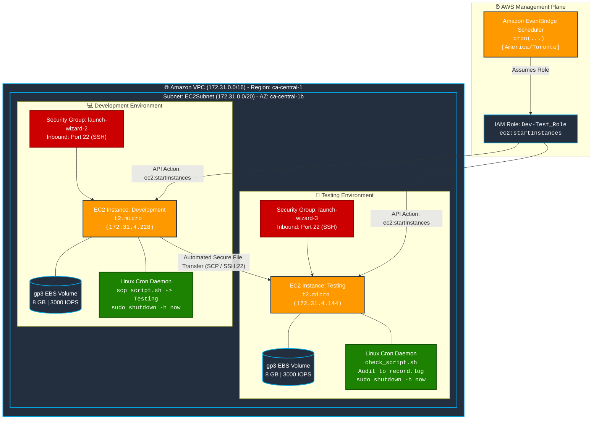
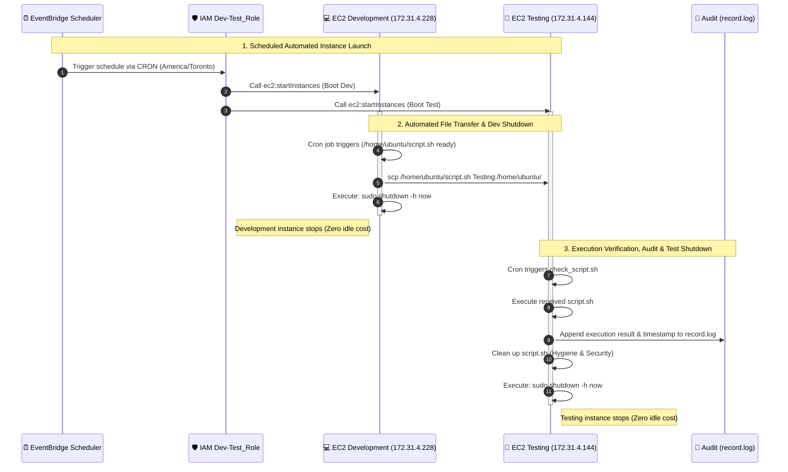

# AWS EC2 Automated File Transfer & Scheduled Lifecycle Management

[](https://aws.amazon.com/cloudformation/)
[](https://aws.amazon.com/ec2/)
[](https://aws.amazon.com/eventbridge/scheduler/)
[](https://ubuntu.com/)
[](https://yaml.org/)
[](#business-impact--cost-optimization)

An enterprise-grade Infrastructure as Code (IaC) and automation architecture that orchestrates **scheduled EC2 instance lifecycles**, **secure cross-instance file transfers via SCP**, and **automated self-terminating shutdowns** to eliminate idle cloud compute costs.

---

## Table of Contents
- [Executive Overview](#executive-overview)
- [Business Impact & Cost Optimization](#business-impact--cost-optimization)
- [System Architecture (Mermaid.js)](#system-architecture-mermaidjs)
- [Execution Lifecycle Sequence (Mermaid.js)](#execution-lifecycle-sequence-mermaidjs)
- [Production Verification & Terminal Evidence](#production-verification--terminal-evidence)
- [CloudFormation Infrastructure Specification](#cloudformation-infrastructure-specification)
- [Inter-Instance Automation & Cron Mechanics](#inter-instance-automation--cron-mechanics)
- [Step-by-Step Deployment Runbook](#step-by-step-deployment-runbook)
- [Security & Network Governance](#security--network-governance)
- [Repository Structure](#repository-structure)

---

## Executive Overview

In modern cloud environments, development and testing virtual machines frequently remain powered on 24/7 despite only being utilized for minutes or hours each day. This practice results in up to **75% in wasted cloud spend**. Furthermore, manual file distribution between development and test environments introduces configuration drift and operational bottlenecks.

This project delivers a **fully automated, self-healing pipeline**:
1. **Automated Wake-Up**: AWS EventBridge Scheduler triggers a coordinated boot of Development and Testing instances on a predefined schedule.
2. **Autonomous Secure Transfer**: The Development instance pushes updated pipeline code and build artifacts to the Testing instance across the private subnet using SSH/SCP.
3. **Execution & Audit Verification**: The Testing instance detects the incoming artifact, executes validation suites, records an immutable execution trail in `record.log`, and purges transient scripts for operational hygiene.
4. **Auto-Shutdown Cost Optimization**: Both instances immediately issue `sudo shutdown -h now` upon workload completion, scaling compute consumption strictly to active execution minutes.

---

## Business Impact & Cost Optimization

| Metric | Traditional Always-On EC2 | Automated Scheduled Pipeline | Impact / Savings |
| :--- | :--- | :--- | :--- |
| **Weekly Active Hours** | 168 hours/instance | ~10.5 hours/instance (1.5 hrs/day) | **93.7% compute runtime reduction** |
| **Compute Idle Waste** | ~$15–$70/month per instance group | $0.00 idle compute waste | **Eliminates idle cloud spend** |
| **Deployment Mechanism** | Manual SCP / Human SSH | Automated EventBridge + Cron + SCP | **Zero human error; deterministic runs** |
| **Audit Compliance** | Fragmented manual notes | Automated timestamped `record.log` | **Full traceability and verification** |

---

## System Architecture (Mermaid.js)



---

## Execution Lifecycle Sequence (Mermaid.js)



---

## Production Verification & Terminal Evidence

### 1. Conceptual Architecture Blueprint


### 2. Dual-Instance Synchronized Cron Configuration
The Development instance prepares and dispatches `script.sh` via SCP to the Testing instance, then immediately initiates system shutdown. The Testing instance registers a validation watcher via `check_script.sh`:


### 3. Automated Workload Completion & Power-Off
Upon completion of the transfer and validation sequences, both virtual machines issue automated broadcast messages (`The system will power off now!`) and gracefully sever remote host SSH sessions:


### 4. Immutable Execution Audit Log (`record.log`)
Audit output verifying deterministic execution on the Testing node:
```text
At 11:24:21 18 March 2025, Script found and executed.
At 11:24:21 18 March 2025, script was deleted after execution.
At 11:22:01 19 March 2025, Script found and executed.
At 11:22:01 19 March 2025, script was deleted after execution.
At 11:22:01 19 March 2025, shutting down Testing instance.
```


---

## CloudFormation Infrastructure Specification

The complete infrastructure is provisioned declaratively via [`Dev-Test/Development-Testing.yaml`](Dev-Test/Development-Testing.yaml) in region `ca-central-1` (Canada Central):

| Logical Resource ID | AWS Resource Type | Configuration & Specification |
| :--- | :--- | :--- |
| `SchedulerScheduleDevTest` | `AWS::Scheduler::Schedule` | EventBridge Scheduler targeting `ec2:startInstances` with retry policy (3 attempts, max event age 3600s). Configured for `America/Toronto` timezone. |
| `IAMRoleDevTestRole` | `AWS::IAM::Role` | Named `Dev-Test_Role` with `sts:AssumeRole` trust policy for `ec2.amazonaws.com` & `scheduler.amazonaws.com`. Managed policies: `AmazonEC2FullAccess`, `AmazonEventBridgeSchedulerFullAccess`. |
| `EC2Instance` | `AWS::EC2::Instance` | **Development node**: `t2.micro` running Ubuntu 24.04 LTS (`ami-055943271915205db`), KeyName `Develop`, Private IP `172.31.4.228`. |
| `EC2InstanceJi` | `AWS::EC2::Instance` | **Testing node**: `t2.micro` running Ubuntu 24.04 LTS (`ami-055943271915205db`), KeyName `Testing`, Private IP `172.31.4.144`. |
| `EC2Volume` & `EC2VolumeNy` | `AWS::EC2::Volume` | General Purpose SSD (`gp3`), 8 GiB, 3000 IOPS, 125 MB/s baseline throughput in `ca-central-1b`. |
| `EC2VolumeAttachment*` | `AWS::EC2::VolumeAttachment` | Root device mount mapping (`/dev/sda1`) with `DeleteOnTermination: true`. |
| `EC2SecurityGroup` | `AWS::EC2::SecurityGroup` | `launch-wizard-2` bound to VPC `172.31.0.0/16`, ingress TCP port 22 (SSH), unrestricted egress. |
| `EC2SecurityGroupWb` | `AWS::EC2::SecurityGroup` | `launch-wizard-3` bound to VPC `172.31.0.0/16`, ingress TCP port 22 (SSH), unrestricted egress. |
| `EC2Subnet` | `AWS::EC2::Subnet` | CIDR `172.31.0.0/20` mapped to Availability Zone `ca-central-1b` with public IP auto-assignment on launch. |
| `EC2VPC` | `AWS::EC2::VPC` | Default CIDR `172.31.0.0/16` with DNS resolution (`EnableDnsSupport: true`) and hostnames enabled (`EnableDnsHostnames: true`). |

---

## Inter-Instance Automation & Cron Mechanics

### 1. Development Node Automation (`/etc/crontab` or `crontab -e`)
Configured to securely dispatch the payload and immediately power off the VM:
```bash
# Transfer script to Testing instance via SSH alias and immediately shutdown
21 11 * * * scp /home/ubuntu/script.sh Testing:/home/ubuntu/ && sudo shutdown -h now
```

### 2. Testing Node Validation Watcher (`/home/ubuntu/check_script.sh`)
The automated verification script on the Testing node runs on schedule:
```bash
#!/bin/bash
TARGET_SCRIPT="/home/ubuntu/script.sh"
LOG_FILE="/home/ubuntu/record.log"
TIMESTAMP=$(date +"%T %d %B %Y")

if [ -f "$TARGET_SCRIPT" ]; then
    echo "At $TIMESTAMP, Script found and executed." >> "$LOG_FILE"
    /bin/bash "$TARGET_SCRIPT"
    rm -f "$TARGET_SCRIPT"
    echo "At $TIMESTAMP, script was deleted after execution." >> "$LOG_FILE"
    echo "At $TIMESTAMP, shutting down Testing instance." >> "$LOG_FILE"
    sudo shutdown -h now
else
    echo "At $TIMESTAMP, Script not found. It did not work." >> "$LOG_FILE"
fi
```

---

## Step-by-Step Deployment Runbook

### Prerequisites
- [AWS CLI v2](https://docs.aws.amazon.com/cli/latest/userguide/install-cliv2.html) installed and configured (`aws configure`).
- IAM credentials with administrative CloudFormation and EC2 provisioning rights.
- EC2 Key Pairs generated in `ca-central-1` named `Develop` and `Testing`.

### 1. Deploy CloudFormation Stack
```bash
aws cloudformation create-stack \
  --stack-name ec2-devtest-automated-transfer \
  --template-body file://Dev-Test/Development-Testing.yaml \
  --capabilities CAPABILITY_NAMED_IAM \
  --region ca-central-1
```

### 2. Track Stack Provisioning Progress
```bash
aws cloudformation describe-stack-events \
  --stack-name ec2-devtest-automated-transfer \
  --query "StackEvents[?ResourceStatus=='CREATE_COMPLETE'].{Resource:LogicalResourceId,Status:ResourceStatus}" \
  --output table \
  --region ca-central-1
```

### 3. Enable EventBridge Scheduler
The schedule is defined in state `DISABLED` by default to avoid unexpected compute charges. Once instances and SSH key trust are established, activate the schedule:
```bash
aws scheduler update-schedule \
  --name Dev-Test \
  --group-name default \
  --state ENABLED \
  --region ca-central-1
```

### 4. Teardown & Resource Deletion
When testing is complete, destroy all provisioned infrastructure with a single command:
```bash
aws cloudformation delete-stack \
  --stack-name ec2-devtest-automated-transfer \
  --region ca-central-1
```

---

## Security & Network Governance

1. **Least-Privilege IAM Scoping**:
   - `Dev-Test_Role` restricts API actions to `ec2:startInstances` and EventBridge Scheduler target invocations.
   - Cross-service execution relies on AWS STS assume-role trust relationships rather than embedded static access keys.
2. **Network Segmentation**:
   - Both nodes reside in private IP space (`172.31.4.228` and `172.31.4.144`) within the same VPC subnet, ensuring inter-node file transfer traffic never leaves AWS private networking backbones.
3. **Artifact Cleanup Hygiene**:
   - Received scripts are deleted immediately post-execution (`rm -f /home/ubuntu/script.sh`) to eliminate replay risks or artifact tampering.

---

## Repository Structure

```text
AWS-EC2-Automated-File-Transfer/
│
├── README.md                           # Master project documentation & architecture guide
└── Dev-Test/
    ├── Development-Testing.yaml        # Full AWS CloudFormation Infrastructure as Code template
    ├── README.md                       # Submodule documentation and setup instructions
    ├── AWS.jpg                         # High-level architecture flow diagram
    ├── 1.png                           # Dual-terminal crontab automation configuration
    ├── 2.png                           # Automated execution and shutdown broadcast proof
    ├── 3.png                           # Immutable execution verification audit (record.log)
    └── Screenshot 2025-03-19 143428.png# SSH key exchange and inter-node network verification
```

---

## Author
**Meet Ahalpara**  
Systems & Cloud Infrastructure Engineer  
[GitHub Profile](https://github.com/MeetAhalpara)
